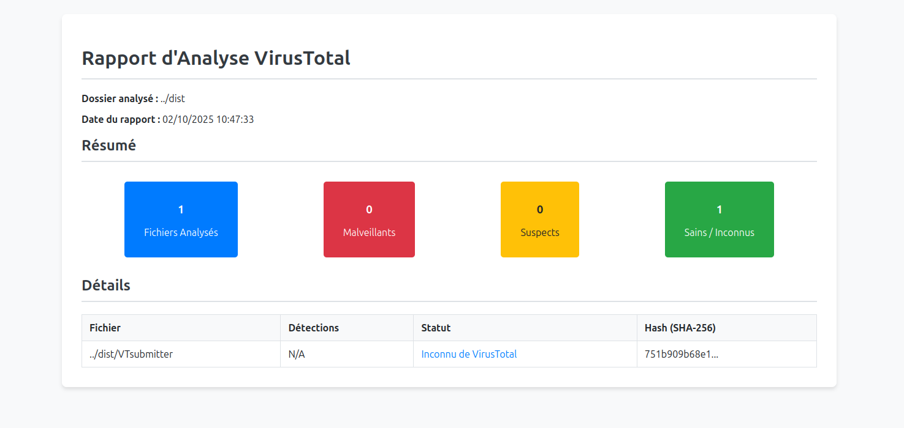

# VirusTotal Folder Scanner

[English](#english) | [Français](#français)

A Python script to recursively scan a folder, check file hashes against the VirusTotal API, and generate comprehensive analysis reports.


*(Note: You can replace this with a real screenshot of your HTML report)*

---

## <a name="english"></a>English Version

### Key Features

* **Recursive Scanning**: Scans a directory and all its subdirectories.
* **Flexible Targeting**: Analyze all files or filter by a specific extension (e.g., `.exe`, `.dll`).
* **Interactive Mode**: If no path is provided, the script prompts for a drag-and-drop folder path.
* **Intelligent Caching**: Results are stored in a local SQLite database (`vt_cache.db`) to avoid re-scanning known files, saving time and API quota.
* **Performance**: Uses multi-threading to process files in parallel, with a progress bar for real-time feedback.
* **API Key Rotation**: Cycles through multiple VirusTotal API keys from a configuration file.
* **Flexible Configuration**: All settings (API keys, cache duration) are managed in a simple `config.ini` file.
* **Directory Exclusion**: Ability to exclude specific directories from the scan (e.g., `.git`, `node_modules`).
* **Comprehensive Reporting**:
    * Real-time console output with logging levels (`--verbose`, `--silent`).
    * A detailed text report (`report.txt`).
    * A rich, interactive HTML report (`report.html`) with a summary, sortable columns, and direct links to VirusTotal.

### Installation & Setup

1.  **Clone the repository:**
    ```bash
    git clone https://github.com/PaulBerra/VTsubmitter.git
    cd VTsubmitter
    ```

2.  **Install dependencies:**
    This script requires Python 3.7+ and a few external libraries. Create a `requirements.txt` file and then run:
    ```bash
    pip install -r requirements.txt
    ```

3.  **Configure the script:**
    * Create a `config.ini` file in the same directory as `VTsubmitter.py`. You can copy a provided `config.ini.template` for this.
    * Open `config.ini` and add your VirusTotal API key(s), separated by commas.

    **`config.ini` example:**
    ```ini
    [virustotal]
    api_keys = YOUR_FIRST_API_KEY_HERE, YOUR_SECOND_API_KEY_HERE

    [settings]
    cache_expiry_days = 30
    ```
4. **(Optionnal) Compil the script:**
   ```
   pyinstaller --onefile VTsubmitter.py
   ```
   
### Usage

The script can be run in several ways from your terminal.

**1. Interactive Mode (easiest):**
Simply run the script without any arguments. It will prompt you to drag and drop the folder you want to scan.
```bash
python3 VTsubmitter.py
```

2. Basic Scan (all files):
Provide the path to the folder as an argument.
```Bash

python3 VTsubmitter.py "/path/to/your/folder"
```

3. Scan with a Specific Extension:
Add the file extension (without the dot) after the folder path.
```Bash

python3 VTsubmitter.py "C:\Windows\System32" dll
```

4. Excluding Directories:
Use the --exclude-dir flag to ignore one or more directories.
```Bash

python3 VTsubmitter.py "/path/to/project" --exclude-dir .git node_modules venv
```

5. Forcing a Rescan:
To ignore the cache and re-check all files with VirusTotal, use --force-rescan.
```Bash

python3 VTsubmitter.py "/path/to/folder" --force-rescan
```

File Structure

```
VT_Analyzer/
├── VTsubmitter.py            # The main Python script
├── config.ini                # Your configuration file
├── requirements.txt          # List of dependencies
├── templates/
│   └── report_template.html  # The Jinja2 template for the HTML report
├── vt_cache.db               # The cache database (created automatically)
├── report.txt                # The text report (generated after a scan)
└── report.html               # The HTML report (generated after a scan)
```


<a name="français"></a>Version Française

Fonctionnalités Principales

* **Analyse Récursive** : Scanne un répertoire et tous ses sous-répertoires.

* **Ciblage Flexible** : Analyse tous les fichiers ou filtre par une extension spécifique (ex: .exe, .dll).

* **Mode Interactif** : Si aucun chemin n'est fourni, le script invite à glisser-déposer un dossier.

* **Mise en Cache Intelligente** : Les résultats sont stockés dans une base de données locale SQLite (vt_cache.db) pour éviter de ré-analyser les fichiers connus, économisant du temps et des requêtes API.

* **Performance** : Utilise le multithreading pour traiter les fichiers en parallèle, avec une barre de progression.

* **Rotation des Clés API** : Utilise à tour de rôle plusieurs clés API VirusTotal définies dans un fichier de configuration.

* **Configuration Flexible** : Tous les paramètres (clés API, durée du cache) sont gérés dans un simple fichier config.ini.

* **Exclusion de Dossiers** : Permet d'exclure des répertoires spécifiques de l'analyse (ex: .git, node_modules).

 Rapports Complets :

   *  Sortie en temps réel dans la console avec niveaux de logs (--verbose, --silent).

   *  Un rapport texte détaillé (report.txt).

   *  Un rapport HTML riche et interactif (report.html) avec un résumé, des colonnes triables et des liens directs vers VirusTotal.

Prérequis et Installation

    Clonez le dépôt :
    ```Bash

    git clone https://github.com/PaulBerra/VTsubmitter.git
    cd VTsubmitter
    ```

Installez les dépendances :
Le script nécessite Python 3.7+ et quelques bibliothèques externes.
```Bash

pip install -r requirements.txt
```

Configurez le script :

    Créez un fichier config.ini dans le même dossier que VTsubmitter.py. Vous pouvez copier le modèle config.ini.template s'il est fourni.

    Ouvrez config.ini et ajoutez votre ou vos clés API VirusTotal, séparées par des virgules.

Exemple de config.ini :
Ini, TOML
```
    [virustotal]
    api_keys = VOTRE_PREMIERE_CLE_API_ICI, VOTRE_DEUXIEME_CLE_API_ICI

    [settings]
    cache_expiry_days = 30
```
Utilisation

Le script peut être lancé de plusieurs manières depuis votre terminal.

1. Mode Interactif (le plus simple) :
Lancez simplement le script sans argument. Il vous demandera de glisser-déposer le dossier à analyser.
```Bash

python3 VTsubmitter.py
```

2. Analyse de base (tous les fichiers) :
Fournissez le chemin du dossier en argument.
```Bash

python3 VTsubmitter.py "/chemin/vers/votre/dossier"
```

3. Analyse avec une extension spécifique :
Ajoutez l'extension (sans le point) après le chemin du dossier.
```Bash

python3 VTsubmitter.py "C:\Windows\System32" dll
```

4. Exclure des dossiers :
Utilisez l'option --exclude-dir pour ignorer un ou plusieurs répertoires.
```Bash

python3 VTsubmitter.py "/chemin/vers/projet" --exclude-dir .git node_modules venv
```

5. Forcer une nouvelle analyse :
Pour ignorer le cache et revérifier tous les fichiers auprès de VirusTotal, utilisez --force-rescan.
```Bash

python3 VTsubmitter.py "/chemin/vers/dossier" --force-rescan
```

Structure des Fichiers
```
VT_Analyzer/
├── VTsubmitter.py            # Le script principal Python
├── config.ini                # Votre fichier de configuration
├── requirements.txt          # Liste des dépendances
├── templates/
│   └── report_template.html  # Le template Jinja2 pour le rapport HTML
├── vt_cache.db               # La base de données de cache (créée automatiquement)
├── report.txt                # Le rapport texte (généré après une analyse)
└── report.html               # Le rapport HTML (généré après une analyse)
```
